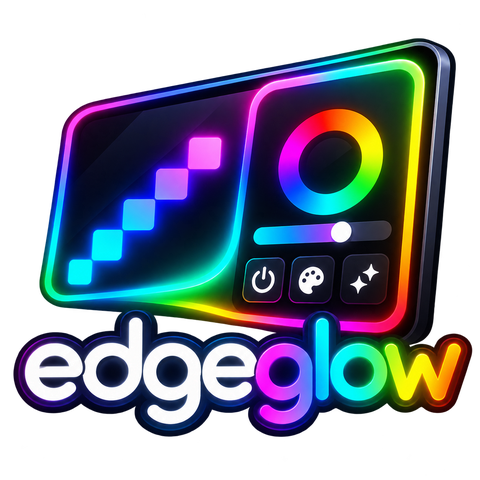
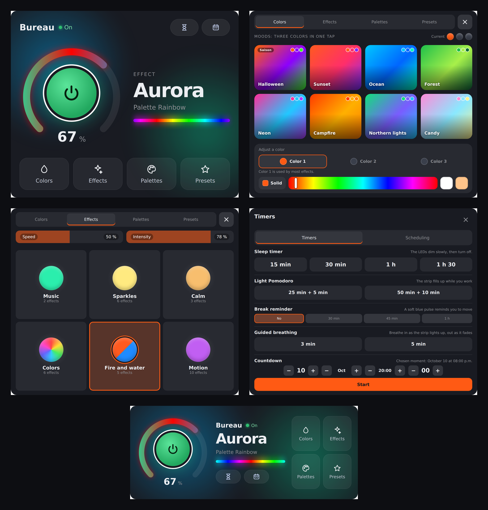

<p align="center">
  
</p>

<p align="center">
  <strong>Control your <a href="https://kno.wled.ge/">WLED</a> controller from the CORSAIR XENEON EDGE touchscreen.</strong>
</p>

<p align="center">
  
  
  
  
</p>

<p align="center">
  <a href="README.md">Français</a> · <strong>English</strong>
</p>

<p align="center">
  <a href="../../releases/latest"><strong>Download the latest release</strong></a>
</p>



EdgeGlow is an iCUE widget that turns your XENEON EDGE into a touch remote for your WLED LED strips. Power, brightness, colors, effects, palettes and presets, plus everyday routines: sunrise alarm, circadian lighting, light Pomodoro, guided breathing, a window to the sky and more.

## Contents

1. [Features](#features)
2. [Requirements](#requirements)
3. [Installation](#installation)
4. [Preparing your WLED](#preparing-your-wled)
5. [Usage](#usage)
6. [Settings in iCUE](#settings-in-icue)
7. [Troubleshooting](#troubleshooting)
8. [FAQ](#faq)
9. [Updating and uninstalling](#updating-and-uninstalling)
10. [Development](#development)
11. [License](#license)

## Features

### Control
- **"Halo" interface**: the power orb sits inside a glowing ring you slide to set the brightness, with the effect name in large type and an ambient glow taken from your LED colors.
- **Live preview**: a light strip shows what your LEDs are actually doing.
- **Color moods**: eight moods (Sunset, Ocean, Forest, Neon, Campfire, Northern lights, Candy, Ice) set the effect's three colors in one tap. Fine tuning of each color, white, warm white and a **Solid** button for a single color.
- **Holiday themes**: as a holiday approaches (New Year, Valentine's Day, St. Patrick's Day, Easter, Saint-Jean-Baptiste, Canada Day, Halloween, Christmas), its mood shows up first.
- **Effects and palettes grouped into families**, with large, easy-to-tap color swatches. Palettes are grouped by their actual colors, with a gradient preview.
- Your WLED **presets**, a **cinema mode** (everything at 10% very warm white) and a **window to the sky** (the strip follows the sky's color based on the sun's position where you live).

### Timers (hourglass button)
- **Sleep timer**: 15 min, 30 min, 1 h or 1 h 30, with a gradual fade.
- **Light Pomodoro**: the strip fills up in orange while you work and breathes green during breaks.
- **Break reminder**: every 30, 45 or 60 minutes, a soft blue pulse reminds you to move.
- **Countdown**: the strip empties during the last hour before the chosen moment, then fireworks go off.
- **Guided breathing**: 3 or 5 minutes of paced breathing; the strip lights up as you breathe in and fades as you breathe out.

### Scheduling (calendar button)
- **On and off schedule** stored **inside WLED**: it works even when your PC is off. Fixed time, or sunrise and sunset with an offset, selected weekdays only, and optionally between two dates.
- **Sunrise alarm**: a gradual 5 to 60 minute dawn, from deep red to warm white.
- **Circadian lighting**: the white follows your day (neutral in the morning, bright at noon, warmer and warmer in the evening).
- Your existing WLED schedules are **always kept**.

### Comfort
- **English and French**: the interface follows your Windows language, or the one you choose.
- **Night-dimmed screen**, adjustable **background opacity** and **color from a PC sensor** (for example your GPU temperature).
- **Demo mode**: until an IP address is entered, the widget shows its interface with animated colors.

## Requirements

| Item | Version |
| --- | --- |
| Windows with **iCUE** | 5.47 or later |
| **CORSAIR XENEON EDGE** screen | connected and detected by iCUE |
| **WLED** controller | 0.14 or later recommended (0.15 and 16 supported) |
| Network | the PC and WLED on the same local network |

## Installation

1. Go to the **[Releases](../../releases/latest)** section of this repository and download **`EdgeGlow-vX.Y.Z.icuewidget`**.
2. Open **iCUE** and select your **XENEON EDGE**.
3. In the widget list, click the **+** button (Import a widget) and pick the downloaded file.
4. Drag **EdgeGlow** onto a tile. Sizes **S** and **M** are designed for it; L and XL work too.
5. The widget starts in **demo mode**. Click the widget in iCUE, then in the **Connexion / Connection** group, enter your **WLED IP address** (setting *Adresse IP du WLED / WLED IP address*) and press **Enter**.
6. If iCUE asks for **network access permission** for EdgeGlow, allow it. Without it, the widget cannot reach your WLED.
7. The logo shows while connecting, then the Halo interface appears. You're all set!

> **Finding your WLED IP address**: in the WLED app or your controller's web interface, go to **Config**, then **WiFi Setup**. To keep it from changing, reserve that address in your router settings.

> **Entering the address on the screen**: you can also tap the screen in demo mode to open a number pad. The iCUE setting is preferred, since the iCUE preview and the screen share it.


## Preparing your WLED

These settings are only needed for scheduling, the sunrise alarm, circadian lighting, the window to the sky and the night-dimmed screen. In the WLED interface, go to **Config**, then **Time & Macros**:

1. Turn on **time sync (NTP)**.
2. Pick your **time zone**.
3. Enter your **latitude** and **longitude** (needed for sunrise and sunset).
4. Save.

In EdgeGlow, the **Scheduling** window shows the "WLED time": it should match the real time.

## Usage

| Gesture | Action |
| --- | --- |
| Tap the orb | Turn on or off |
| Hold the orb | Open Timers |
| Slide along the ring | Set brightness |
| Colors, Effects, Palettes, Presets | Open that menu (the X closes it) |
| Hourglass | Timers: sleep, Pomodoro, break reminder, countdown, breathing |
| Calendar | Scheduling: schedule, sunrise alarm, circadian lighting |
| Tap a badge (Off in 15 min, Cinema, Sky…) | Manage or stop the current activity |

**Good to know**
- The first time you save a schedule, your LEDs may blink once: WLED applies the command while creating its presets. EdgeGlow restores your lighting right away.
- The internal presets "EdgeGlow Allumer", "EdgeGlow Éteindre", "EdgeGlow Réveil" and "EdgeGlow Circadien 1 to 5" are hidden in the Presets tab. Don't delete them in WLED if you use these features.
- Pomodoro, break reminders, countdowns, breathing and the window to the sky run while iCUE is open. The schedule, the sunrise alarm and circadian lighting are handled by WLED itself.

## Settings in iCUE

Setting labels are shown in both French and English in iCUE.

| Group | Setting | What it does |
| --- | --- | --- |
| Connexion / Connection | Adresse IP du WLED / WLED IP address | Your controller's address. `0.0.0.0` shows demo mode. |
| Connexion / Connection | Nom affiché / Display name | `auto` uses the name configured in WLED. |
| Affichage / Display | Langue / Language | Automatic (Windows language), Français or English. |
| Affichage / Display | Opacité du fond / Background opacity | 100%: solid background. 0%: invisible background. |
| Affichage / Display | Écran atténué la nuit / Dim screen at night | Dims the interface from sunset to sunrise. |
| Affichage / Display | Startup tab, show effects, palettes and presets | Choose what is shown. |
| Affichage / Display | Aperçu des DEL en direct / Live LED preview | Shows the live light strip. |
| Réaction au PC / PC reaction | Couleur selon un capteur du PC / Color from a PC sensor | The color follows a sensor (blue at rest, red at the high value). |
| Réaction au PC / PC reaction | Sensor, low value, high value | The sensor and its bounds. |
| Style | Colors | Active with the XENEON EDGE "custom style". |
| Avancé / Advanced | Rafraîchissement HTTP / HTTP refresh | Only used if the WebSocket is unavailable. |
| Avancé / Advanced | Mode diagnostic / Diagnostic mode | Shows connection status and received settings. |

## Troubleshooting

| Problem | Solution |
| --- | --- |
| **Import fails in iCUE** | Make sure you have iCUE 5.47 or later and that you downloaded the `.icuewidget` file from Releases. |
| **"Controller not found"** | Open the IP address in your browser to check that WLED answers, make sure the PC and WLED are on the same network, and allow iCUE's network permission. |
| **The widget stays in demo mode** | Enter the address in the Connexion / Connection group, then press Enter or click elsewhere. |
| **The iCUE preview doesn't show my settings, but the screen does** | The preview and the screen each have their own memory; enter the address in the iCUE settings rather than on the screen keypad. |
| **The schedule doesn't trigger** | Check the WLED time, NTP, time zone and, for sun-based times, latitude and longitude. |
| **"Sunrise (or sunset) is already used"** | WLED 0.15 has a single slot for each. Choose a fixed time, or move to WLED 16. |
| **No live strip** | WLED sends the live preview to one client at a time: close the "Peek" preview in the WLED web interface. |
| **Unstable connection** | WLED limits simultaneous WebSocket connections: close unused WLED tabs. |

If the problem persists, turn on **Diagnostic mode** (Avancé / Advanced group) and [open an issue](../../issues/new/choose) with a screenshot.

## FAQ

**Does EdgeGlow send data to the Internet?**
No. The widget only talks to your WLED, on your local network. No data is collected or sent anywhere else.

**Can I control several WLED controllers?**
Not yet: one widget controls one controller. You can, however, place several EdgeGlow widgets on your screen, each with its own IP address.

**My strip is RGBW, is it supported?**
Yes. White and warm white use the white channel, and previews take it into account.

**Does it work without a XENEON EDGE?**
It is designed for the XENEON EDGE touchscreen and iCUE.

## Updating and uninstalling

- **Update**: download the new version from Releases, remove the old EdgeGlow from its tile, delete it from the iCUE widget list, then import the new file. Enter the IP address again if iCUE did not keep it.
- **Uninstall**: remove the widget from its tile and delete it from the list. In WLED, you can then delete the presets starting with "EdgeGlow" and their schedules.

## Development

The widget code lives in [`widget/`](widget): plain HTML, CSS and JavaScript, no dependencies.

| File | Role |
| --- | --- |
| `index.html` | Structure and iCUE settings (`x-icue-property` tags) |
| `scripts/wled-client.js` | WLED communication (WebSocket, with HTTP fallback) |
| `scripts/schedule.js` | Schedule, sunrise alarm and circadian lighting inside WLED (0.15 and 16 formats) |
| `scripts/categories.js` | Effect and palette families |
| `scripts/i18n.js` | English translation |
| `scripts/main.js` | Interface and logic |
| `styles/main.css` | Look and feel |

**Test in a browser without iCUE**: open `widget/index.html` in Chrome with your WLED address, for example `index.html?ip=192.168.1.50`.

**Package**:

```
npm install -g icuewidget-cli
icuewidget validate widget
icuewidget package widget
```

**Release**: bump the version in `widget/manifest.json`, add an entry to [`CHANGELOG.md`](CHANGELOG.md), then create a Release tagged `vX.Y.Z`. The GitHub Action builds the `.icuewidget` file and attaches it to the Release.

Contributions are welcome: please open an issue to discuss larger changes first.

## License

[MIT](LICENSE) © 2026 Simon Dufour.

EdgeGlow is an independent project, not affiliated with or endorsed by CORSAIR, Elgato or the WLED project. CORSAIR, iCUE and XENEON are trademarks of their respective owners.
