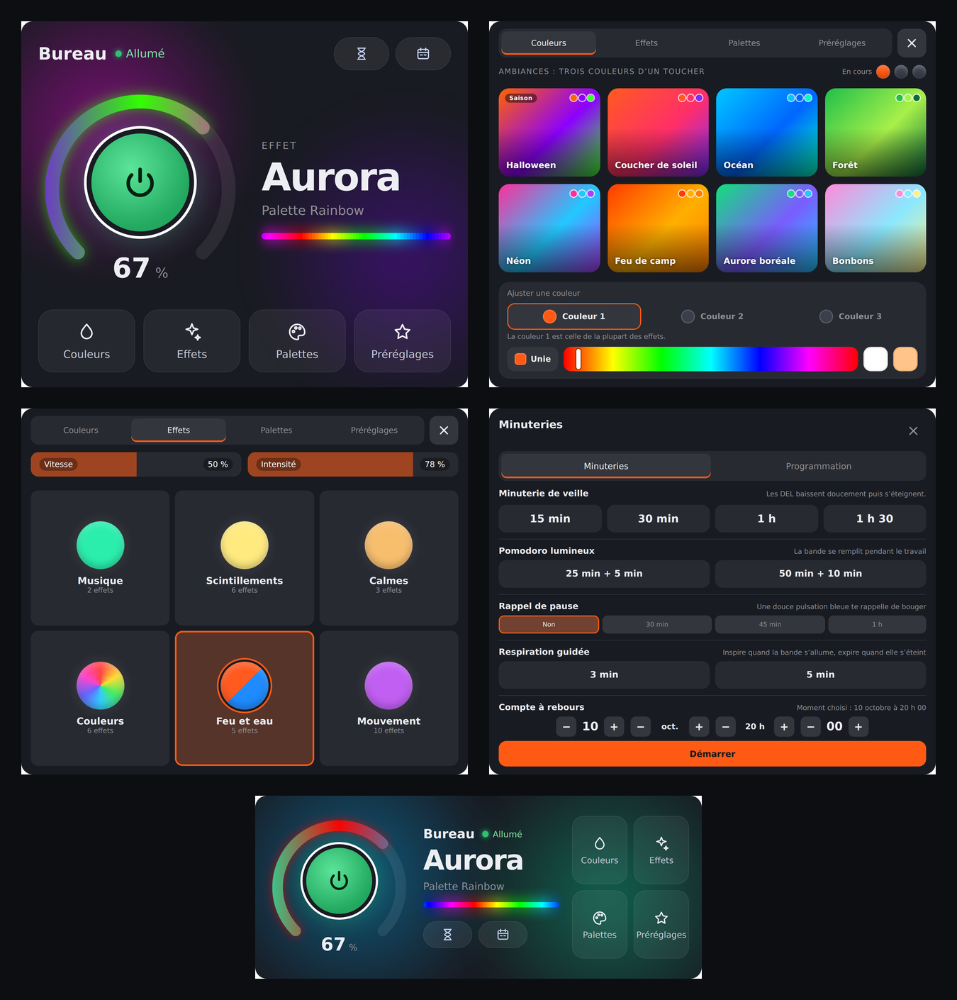

<p align="center">
  
</p>

<p align="center">
  <strong>Pilote ton contrôleur <a href="https://kno.wled.ge/">WLED</a> depuis l’écran tactile CORSAIR XENEON EDGE.</strong>
</p>

<p align="center">
  
  
  
  
</p>

<p align="center">
  <strong>Français</strong> · <a href="README.en.md">English</a>
</p>

<p align="center">
  <a href="../../releases/latest"><strong>Télécharger la dernière version</strong></a>
</p>



EdgeGlow est un widget pour iCUE qui transforme ton XENEON EDGE en télécommande tactile pour tes bandes DEL WLED. Allumage, luminosité, couleurs, effets, palettes et préréglages, mais aussi des routines pensées pour le quotidien : réveil lever du soleil, lumière circadienne, Pomodoro lumineux, respiration guidée, fenêtre sur le ciel et plus encore.

## Sommaire

1. [Fonctions](#fonctions)
2. [Prérequis](#prérequis)
3. [Installation](#installation)
4. [Préparer ton WLED](#préparer-ton-wled)
5. [Utilisation](#utilisation)
6. [Réglages dans iCUE](#réglages-dans-icue)
7. [Dépannage](#dépannage)
8. [Questions fréquentes](#questions-fréquentes)
9. [Mise à jour et désinstallation](#mise-à-jour-et-désinstallation)
10. [Développement](#développement)
11. [Licence](#licence)

## Fonctions

### Contrôle
- **Interface « Halo »** : l’orbe d’allumage au centre d’un anneau lumineux qu’on fait glisser pour régler la luminosité, le nom de l’effet en grand et une ambiance qui reprend les couleurs de tes DEL.
- **Aperçu en direct** : une bande lumineuse montre ce que font réellement tes DEL.
- **Ambiances de couleurs** : huit ambiances (Coucher de soleil, Océan, Forêt, Néon, Feu de camp, Aurore boréale, Bonbons, Glace) règlent les trois couleurs de l’effet d’un toucher. Réglage fin de chaque couleur, blanc, blanc chaud et bouton **Unie** pour une seule couleur.
- **Thèmes des fêtes** : à l’approche d’une fête (Jour de l’An, Saint-Valentin, Saint-Patrick, Pâques, Fête nationale, Fête du Canada, Halloween, Noël), son ambiance apparaît en premier.
- **Effets et palettes classés en familles**, avec de grosses pastilles faciles à toucher. Les palettes sont classées selon leurs vraies couleurs, avec un aperçu en dégradé.
- **Préréglages** de ton WLED, **mode cinéma** (tout à 10 % en blanc très chaud) et **fenêtre sur le ciel** (la bande suit la couleur du ciel selon la position du soleil chez toi).

### Minuteries (bouton sablier)
- **Minuterie de veille** : 15 min, 30 min, 1 h ou 1 h 30, avec un fondu progressif.
- **Pomodoro lumineux** : la bande se remplit en orange pendant le travail et respire en vert pendant la pause.
- **Rappel de pause** : toutes les 30, 45 ou 60 minutes, une douce respiration bleue te rappelle de bouger.
- **Compte à rebours** : la bande se vide pendant la dernière heure avant le moment choisi, puis des feux d’artifice éclatent.
- **Respiration guidée** : 3 ou 5 minutes de cohérence cardiaque, la bande s’allume quand tu inspires et s’éteint quand tu expires.

### Programmation (bouton calendrier)
- **Horaire d’allumage et d’extinction** enregistré **dans le WLED** : il fonctionne même quand ton PC est éteint. Heure fixe, ou lever et coucher du soleil avec un décalage, certains jours seulement, et au besoin entre deux dates.
- **Réveil lever du soleil** : une aube progressive de 5 à 60 minutes, du rouge sombre au blanc chaud.
- **Lumière circadienne** : le blanc suit ta journée (neutre le matin, lumineux le midi, de plus en plus chaud le soir).
- Tes horaires existants dans WLED sont **toujours conservés**.

### Confort
- **Français et anglais** : l’interface suit la langue de Windows, ou celle que tu choisis.
- **Écran atténué la nuit**, **opacité du fond** réglable et **couleur selon un capteur du PC** (par exemple la température du processeur graphique).
- **Mode démo** : tant que l’adresse IP n’est pas entrée, le widget montre son interface avec des couleurs animées.

## Prérequis

| Élément | Version |
| --- | --- |
| Windows avec **iCUE** | 5.47 ou plus récent |
| Écran **CORSAIR XENEON EDGE** | branché et reconnu par iCUE |
| Contrôleur **WLED** | 0.14 ou plus récent recommandé (0.15 et 16 sont pris en charge) |
| Réseau | le PC et le WLED sur le même réseau local |

## Installation

1. Va dans la section **[Releases](../../releases/latest)** de ce dépôt et télécharge le fichier **`EdgeGlow-vX.Y.Z.icuewidget`**.
2. Ouvre **iCUE** et sélectionne ton **XENEON EDGE**.
3. Dans la liste des widgets, clique sur le bouton **+** (Importer un widget) et choisis le fichier téléchargé.
4. Glisse **EdgeGlow** sur une tuile de ton écran. Les tailles **S** et **M** sont conçues pour lui; L et XL fonctionnent aussi.
5. Le widget s’affiche en **mode démo**. Clique sur le widget dans iCUE, puis dans le groupe **Connexion / Connection**, entre l’**adresse IP de ton WLED** (réglage *Adresse IP du WLED / WLED IP address*) et appuie sur **Entrée**.
6. Si iCUE demande l’**autorisation d’accès au réseau** pour EdgeGlow, accepte-la. Sans elle, le widget ne peut pas joindre ton WLED.
7. Le logo s’affiche le temps de la connexion, puis l’interface Halo apparaît. C’est prêt!

> **Trouver l’adresse IP de ton WLED** : dans l’application WLED ou l’interface web de ton contrôleur, va dans **Config**, puis **WiFi Setup**. Pour éviter qu’elle change, réserve cette adresse dans les réglages de ton routeur.

> **Saisir l’adresse sur l’écran** : tu peux aussi toucher l’écran en mode démo pour ouvrir un clavier numérique. L’adresse entrée dans les réglages d’iCUE reste préférable, car l’aperçu d’iCUE et l’écran la partagent.

## Préparer ton WLED

Ces réglages ne sont nécessaires que pour l’horaire, le réveil, la lumière circadienne, la fenêtre sur le ciel et l’écran atténué la nuit. Dans l’interface de WLED, va dans **Config**, puis **Time & Macros** :

1. Active la **synchronisation de l’heure (NTP)**.
2. Choisis ton **fuseau horaire**.
3. Entre ta **latitude** et ta **longitude** (nécessaires pour le lever et le coucher du soleil).
4. Enregistre.

Dans EdgeGlow, la fenêtre **Programmation** affiche l’« Heure du WLED » : elle doit correspondre à l’heure réelle.

## Utilisation

| Geste | Action |
| --- | --- |
| Toucher l’orbe | Allumer ou éteindre |
| Garder le doigt sur l’orbe | Ouvrir les Minuteries |
| Glisser le long de l’anneau | Régler la luminosité |
| Couleurs, Effets, Palettes, Préréglages | Ouvrir le menu correspondant (le X le referme) |
| Sablier | Minuteries : veille, Pomodoro, rappel de pause, compte à rebours, respiration |
| Calendrier | Programmation : horaire, réveil, lumière circadienne |
| Toucher un badge (Arrêt dans 15 min, Cinéma, Ciel…) | Gérer ou arrêter l’activité en cours |

**Bon à savoir**
- La première fois que tu enregistres un horaire, tes DEL peuvent clignoter une fois : WLED applique la commande au moment de créer ses préréglages. EdgeGlow rétablit aussitôt ton éclairage.
- Les préréglages internes « EdgeGlow Allumer », « EdgeGlow Éteindre », « EdgeGlow Réveil » et « EdgeGlow Circadien 1 à 5 » sont masqués dans l’onglet Préréglages. Ne les supprime pas dans WLED si tu utilises ces fonctions.
- Le Pomodoro, le rappel de pause, le compte à rebours, la respiration et la fenêtre sur le ciel fonctionnent quand iCUE est ouvert. L’horaire, le réveil et la lumière circadienne sont gérés par le WLED lui-même.

## Réglages dans iCUE

Les étiquettes des réglages sont affichées en français et en anglais dans iCUE.

| Groupe | Réglage | Rôle |
| --- | --- | --- |
| Connexion / Connection | Adresse IP du WLED / WLED IP address | Adresse de ton contrôleur. `0.0.0.0` affiche le mode démo. |
| Connexion / Connection | Nom affiché / Display name | `auto` reprend le nom configuré dans WLED. |
| Affichage / Display | Langue / Language | Automatique (langue de Windows), Français ou English. |
| Affichage / Display | Opacité du fond / Background opacity | 100 % : fond plein. 0 % : fond invisible. |
| Affichage / Display | Écran atténué la nuit / Dim screen at night | Assombrit l’interface du coucher au lever du soleil. |
| Affichage / Display | Onglet au démarrage, afficher les effets, palettes et préréglages | Choisis ce qui s’affiche. |
| Affichage / Display | Aperçu des DEL en direct / Live LED preview | Affiche la bande lumineuse en temps réel. |
| Réaction au PC / PC reaction | Couleur selon un capteur du PC / Color from a PC sensor | La couleur suit un capteur (bleu au repos, rouge à la valeur haute). |
| Réaction au PC / PC reaction | Capteur, valeur basse, valeur haute | Le capteur suivi et ses bornes. |
| Style | Couleurs | Actives avec le « style personnalisé » du XENEON EDGE. |
| Avancé / Advanced | Rafraîchissement HTTP / HTTP refresh | Utilisé seulement si le WebSocket est indisponible. |
| Avancé / Advanced | Mode diagnostic / Diagnostic mode | Affiche l’état de la connexion et les réglages reçus. |

## Dépannage

| Problème | Solution |
| --- | --- |
| **L’import échoue dans iCUE** | Vérifie que tu as iCUE 5.47 ou plus récent, et que le fichier téléchargé est bien le `.icuewidget` de la section Releases. |
| **« Contrôleur introuvable »** | Ouvre l’adresse IP dans ton navigateur pour vérifier que le WLED répond, vérifie que le PC et le WLED sont sur le même réseau, et accepte l’autorisation réseau d’iCUE. |
| **Le widget reste en mode démo** | Entre l’adresse dans le groupe Connexion / Connection, puis appuie sur Entrée ou clique ailleurs. |
| **L’aperçu d’iCUE ne montre pas mes réglages, mais l’écran oui** | L’aperçu et l’écran ont chacun leur mémoire; entre l’adresse dans les réglages d’iCUE plutôt qu’au clavier de l’écran. |
| **L’horaire ne se déclenche pas** | Vérifie l’heure du WLED, le NTP, le fuseau horaire et, pour le soleil, la latitude et la longitude. |
| **« Le lever (ou coucher) du soleil est déjà utilisé »** | WLED 0.15 n’a qu’une case pour chacun. Choisis une heure fixe, ou passe à WLED 16. |
| **La bande en direct n’apparaît pas** | WLED n’envoie l’aperçu qu’à un client à la fois : ferme l’aperçu (« Peek ») de l’interface WLED dans ton navigateur. |
| **Connexion instable** | WLED limite le nombre de connexions WebSocket simultanées : ferme les onglets WLED inutiles. |

Si le problème persiste, active le **Mode diagnostic** (groupe Avancé / Advanced) et [ouvre un ticket](../../issues/new/choose) avec une capture de l’écran.

## Questions fréquentes

**EdgeGlow envoie-t-il des données sur Internet?**
Non. Le widget communique seulement avec ton WLED, sur ton réseau local. Aucune donnée n’est collectée ni envoyée ailleurs.

**Puis-je piloter plusieurs WLED?**
Pas encore : un widget pilote un contrôleur. Tu peux toutefois placer plusieurs widgets EdgeGlow sur ton écran, chacun avec sa propre adresse IP.

**Ma bande est RGBW, est-ce compatible?**
Oui. Le blanc et le blanc chaud utilisent le canal blanc, et les aperçus en tiennent compte.

**Le widget fonctionne-t-il sans XENEON EDGE?**
Il est conçu pour l’écran tactile du XENEON EDGE et pour iCUE.

## Mise à jour et désinstallation

- **Mettre à jour** : télécharge la nouvelle version dans les Releases, retire l’ancien EdgeGlow de ta tuile, supprime-le de la liste des widgets d’iCUE, puis importe le nouveau fichier. Entre de nouveau l’adresse IP si iCUE ne l’a pas conservée.
- **Désinstaller** : retire le widget de la tuile et supprime-le de la liste. Dans WLED, tu peux ensuite supprimer les préréglages qui commencent par « EdgeGlow » et les horaires associés.

## Développement

Le code du widget est dans [`widget/`](widget) : HTML, CSS et JavaScript, sans dépendance.

| Fichier | Rôle |
| --- | --- |
| `index.html` | Structure et réglages iCUE (balises `x-icue-property`) |
| `scripts/wled-client.js` | Communication avec WLED (WebSocket, puis HTTP en secours) |
| `scripts/schedule.js` | Horaire, réveil et lumière circadienne dans le WLED (formats 0.15 et 16) |
| `scripts/categories.js` | Classement des effets et des palettes |
| `scripts/i18n.js` | Traduction anglaise |
| `scripts/main.js` | Interface et logique |
| `styles/main.css` | Apparence |

**Tester dans un navigateur, sans iCUE** : ouvre `widget/index.html` dans Chrome en ajoutant l’adresse de ton WLED, par exemple `index.html?ip=192.168.1.50`.

**Empaqueter** :

```
npm install -g icuewidget-cli
icuewidget validate widget
icuewidget package widget
```

**Publier une version** : change le numéro dans `widget/manifest.json`, ajoute une entrée dans le [`CHANGELOG.md`](CHANGELOG.md), puis crée une Release avec l’étiquette `vX.Y.Z`. L’action GitHub fabrique le fichier `.icuewidget` et le joint à la Release.

Les contributions sont les bienvenues : ouvre un ticket pour en discuter avant une grosse modification.

## Licence

[MIT](LICENSE) © 2026 Simon Dufour.

EdgeGlow est un projet indépendant. Il n’est ni affilié ni approuvé par CORSAIR, Elgato ou le projet WLED. CORSAIR, iCUE et XENEON sont des marques de leurs propriétaires respectifs.
